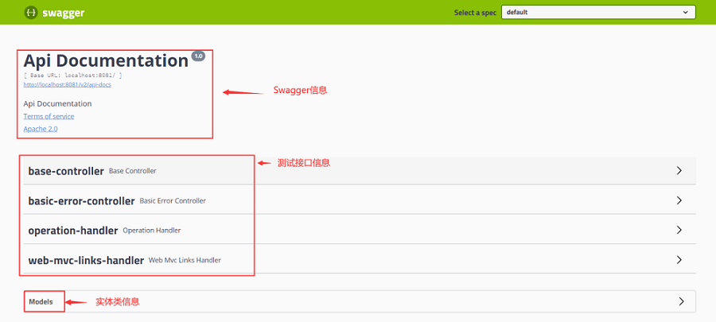
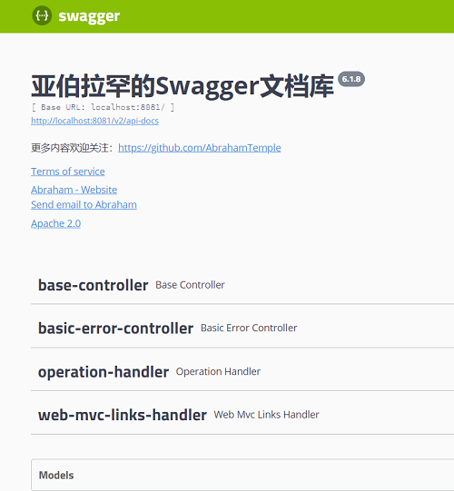
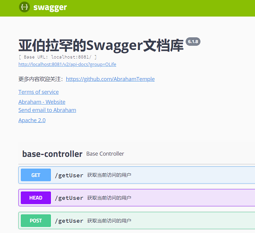
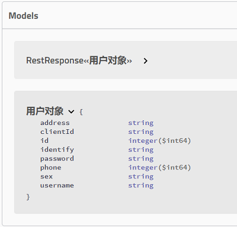
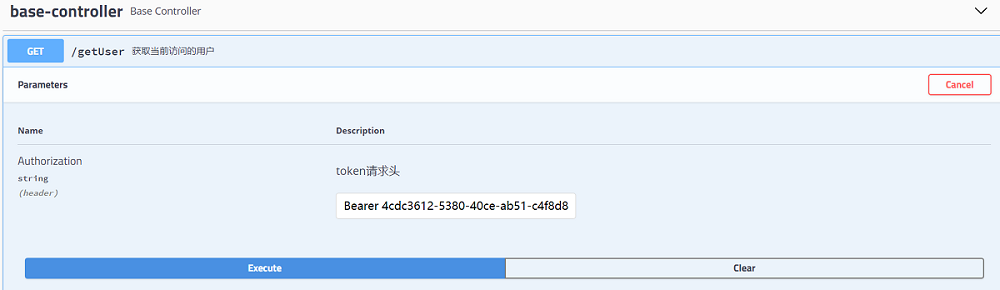

# Swagger2使用

## 依赖

``` xml
<!--Swagger2 API-->
<dependency>
    <groupId>io.springfox</groupId>
    <artifactId>springfox-swagger2</artifactId>
    <version>2.9.2</version>
</dependency>
<!--Swagger UI-->
<dependency>
    <groupId>io.springfox</groupId>
    <artifactId>springfox-swagger-ui</artifactId>
    <version>2.9.2</version>
</dependency>
```

## 基本配置

### 开启Swagger
``` java
@Configuration
@EnableSwagger2
public class SwaggerConfig {
}
```

若使用Security要开放对应拦截

``` java
@Override
public void configure(HttpSecurity http) throws Exception {
    http.
            csrf().disable().
            authorizeRequests()
            .antMatchers("/v2/**","/webjars/**","/swagger/**","/swagger-ui.html","/swagger-resources/**")
            .permitAll()
            .anyRequest().authenticated();
}
```



### Swagger页面设置

- Docket配置

``` java
@Bean
public Docket docket(){
    return new Docket(DocumentationType.SWAGGER_2);
}
```

- Docket配置源码导向

``` java
public Docket(DocumentationType documentationType) {
    this.apiInfo = ApiInfo.DEFAULT;
    this.groupName = "default";
    this.enabled = true;
    this.genericsNamingStrategy = new DefaultGenericTypeNamingStrategy();
    this.applyDefaultResponseMessages = true;
    this.host = "";
    this.pathMapping = Optional.absent();
    this.apiSelector = ApiSelector.DEFAULT;
    this.enableUrlTemplating = false;
    this.vendorExtensions = Lists.newArrayList();
    this.documentationType = documentationType;
}
```

``` java
public class DocumentationType extends SimplePluginMetadata {
    public static final DocumentationType SWAGGER_12 = new DocumentationType("swagger", "1.2");
    public static final DocumentationType SWAGGER_2 = new DocumentationType("swagger", "2.0");
    public static final DocumentationType SPRING_WEB = new DocumentationType("spring-web", "1.0");
    ...
```

- ApiInfo配置

``` java
@Bean
public Docket docket(){
    return new Docket(DocumentationType.SWAGGER_2).apiInfo(apiInfo());
}
```

``` java
@Bean
public ApiInfo apiInfo(){
    //作者信息
    Contact MY_CONTACT = new Contact("Abraham", "https://github.com/AbrahamTemple", "1135530168@qq.com");
    return new ApiInfo("亚伯拉罕的Swagger文档库", "更多内容欢迎关注：https://github.com/AbrahamTemple", 
            "6.1.8","https://github.com/AbrahamTemple", MY_CONTACT, 
            "Apache 2.0", "http://www.apache.org/licenses/LICENSE-2.0", new ArrayList());
}
```

- ApiInfo配置源码导向

``` java
public class ApiInfo {
    public static final Contact DEFAULT_CONTACT = new Contact("", "", "");
    public static final ApiInfo DEFAULT;
    private final String version;
    private final String title;
    private final String description;
    private final String termsOfServiceUrl;
    private final String license;
    private final String licenseUrl;
    private final Contact contact;
    private final List<VendorExtension> vendorExtensions;
    ...
    static {
    DEFAULT = new ApiInfo("Api Documentation", "Api Documentation", "1.0", "urn:tos", DEFAULT_CONTACT, "Apache 2.0", "http://www.apache.org/licenses/LICENSE-2.0", new ArrayList());
    }
}    
```



## 扫描配置

``` java
@Bean
public Docket docket(){
  return new Docket(DocumentationType.SWAGGER_2).apiInfo(apiInfo())
      .select()
//    .apis(RequestHandlerSelectors.basePackage("com.cloud.olifebase.rest")) //扫描指定的包
//    .apis(RequestHandlerSelectors.withClassAnnotation(GetMapping.class)) //扫描指定注解使用对象
      .apis(RequestHandlerSelectors.withMethodAnnotation(RestController.class)) //扫描类上的注解
      .build();
    }
```

## 过滤配置

``` java
@Bean
public Docket docket(){
  return new Docket(DocumentationType.SWAGGER_2).apiInfo(apiInfo())
      .select()
      .paths(PathSelectors.ant("/**")) //只能扫描/下的所有请求
      .build();
}
```

## 不启动Swagger

``` java
@Bean
public Docket docket(){
  return new Docket(DocumentationType.SWAGGER_2).apiInfo(apiInfo())
    .enable(false);
}
```

开发环境不启动

``` java
@Bean
public Docket docket(){
	Profiles profiles = Profiles.of("dev"); //找到	spring.profiles.active为dev的值
	boolean isDevEnv = environment.acceptsProfiles(profiles); //是否为生产环境
    return new Docket(DocumentationType.SWAGGER_2).apiInfo(apiInfo())
      .enable(isDevEnv);
}
```

## 配置分组

``` java
@Bean
public Docket docket(){
  return new Docket(DocumentationType.SWAGGER_2).apiInfo(apiInfo())
    .groupName("Group1");
}
```

## API注解

- 实体类注释

``` java
@ApiModel("用户实体类")
public class OUser implements Serializable {

    @ApiModelProperty("授权id")
    private String clientId;

}
```

- 方法注释

``` java
@ApiOperation("获取当前访问的用户")
@RequestMapping("getUser")
public RestResponse<OUser> getUser(){
    return new RestResponse<OUser>(HttpStatus.OK.value(), HttpStatus.OK.toString(),userService.getByClientId(clientId));
}
```

- 类注释

``` java
@Api("资源主控制器")
@RestController
public class BaseController {
}
```

- 参数注释

``` java
@RequestMapping("/getUser")
public RestResponse<OUser> getUser(@RequestHeader(value = HttpHeaders.AUTHORIZATION, required = false) @ApiParam("token请求头") String authentication){
}
```







